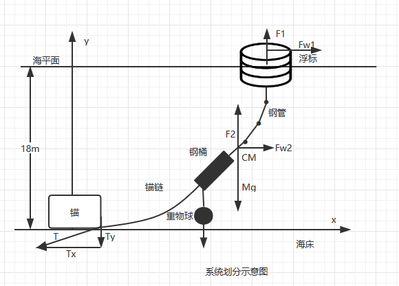
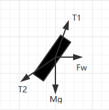

# 变量表

| 文献名               | 程序变量名      | 中文名               | 备注                   |
| -------------------- | --------------- | -------------------- | ---------------------- |
| $M_{Sys}$            | MSys            | 系统质量             | 此处系统不包括锚，全局 |
| $M_{Bouy}$           | MBouy           | 浮标质量             |                        |
| $F_{BuoyancyBuoy}$   | FBuoyancyBuoy   | 浮标浮力             |                        |
| $F_{WindBouy}$       | FWindBouy       | 浮标收到的风力       |                        |
| $F_{FlowBony}$       | FFlowBony       | 浮标受到水流的力     |                        |
| $F_{Buoyancysystem}$ | FBuoyancySystem | 系统浮力             | 包括浮标               |
| $F_{FLowSystem}$     | FFlowSystem     | 系统受到水流的力     | 包括浮标               |
| $F_{Chainend}$       | FChainend       | 锚对锚链末端的拉力   |                        |
| $AngleF_{Chainend}$  | AngleFChainend  | 拉力和x轴正方向夹角  |                        |
| $F_{DrumsPipes}$     | FDrumsPipe      | 钢管末端对钢桶的拉力 |                        |
| $F_{DrumsChain}$     | FDrumsChain     | 锚链末端对钢桶的拉力 |                        |
| $M_{Drum}$           | MDrum           | 钢桶质量             |                        |
| $F_{FlowDrum}$       | FFlowDrum       | 钢桶收到水流的力     |                        |
|                      |                 |                      |                        |

