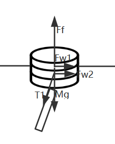

# 变量表

| 文献名               | 程序变量名      | 中文名                                  | 备注                   |
| -------------------- | --------------- | --------------------------------------- | ---------------------- |
| $M_{Sys}$            | MSys            | 系统质量                                | 此处系统不包括锚，全局 |
| $F_{Buoyancysystem}$ | FBuoyancySystem | 系统浮力                                | 包括浮标               |
| $F_{FLowSystem}$     | FFlowSystem     | 系统受到水流的力                        | 包括浮标               |
| $M_{Buoy}$           | MBuoy           | 浮标质量                                |                        |
| $F_{BuoyancyBuoy}$   | FBuoyancyBuoy   | 浮标浮力                                |                        |
| $F_{Buoyancy}$       | FBuoyancynode   | 节点收到的浮力                          |                        |
| $F_{WindBuoy}$       | FWindBuoy       | 浮标收到的风力                          |                        |
| $F_{FlowBuoy}$       | FFlowBuoy       | 浮标受到水流的力                        |                        |
| $M_{Buoy}$           | MBuoy           | 浮标质量                                |                        |
| $H_{Buoy}$           | HBuoy           | 浮标高度                                |                        |
| $R_{Buoy}$           | RBuoy           | 浮标半径                                |                        |
| $M_{Pipe}$           | MPipe           | 钢管质量                                |                        |
| $H_{Pipe}$           | HPipe           | 钢管高度                                |                        |
| $R_{Pipe}$           | RPipe           | 钢管半径                                |                        |
| $M_{Drums}$           | MDrum           | 钢桶质量                                |                        |
| $H_{Drums}$          | HeightDrums     | 桶的高度                                |                        |
| $R_{Drums}$          | RDrums          | 桶的半径                                |                        |
| $F_{DrumsPipes}$     | FDrumsPipe      | 钢管末端对钢桶的拉力                    |                        |
| $F_{DrumsChain}$     | FDrumsChain     | 锚链末端对钢桶的拉力                    |                        |
| $M_{Ball}$           | MBall           | 球的质量                                |                        |
| $F_{FlowDrum}$       | FFlowDrum       | 钢桶收到水流的力                        |                        |
| $F_{Chainend}$       | FChainend       | 锚对锚链末端的拉力                      |                        |
| $AngleF_{Chainend}$  | AngleFChainend  | 拉力和x轴正方向夹角                     |                        |
| $Length_{ChainNode}$ | LengthChainNode | 锚链链结长度                            |                        |
| $\rho_{Chain}$       | RhoChain        | 锚链线密度                              |                        |
| $L_{Chain}$          | LengthChain     | 链长                                    |                        |
| $F_{alpha}$          | FNodeAlpha      | 上位结点对该节点的力                    |                        |
| $F_{beta}$           | FNodeBeta       | 下位节点对该节点的力                    |                        |
| $F_{Flow}$           | FFlow           | 节点收到水流的力                        |                        |
| $Anlge_{\alpha}$     | AngleAlpha     | 上位结点对该节点的力对自然坐标系的角度  |                        |
|  |  |  | |
| $Angle_{\beta}$      | AngleBeta       | 下位节点对该节点的力对自然坐标i下的角度 |                        |
| $M$                  | M               | 节点质量                                |                        |
| $\rho_{Water}$       | RhoWater        | 水的密度                                |                        |
| $V_{wind}$           | SpeedWind       | 风速                                    |                        |
| $V_{Water}$          | SpeedWater      | 水速                                    |                        |
| $H_{WaterLine}$      | HeightWaterLine | 吃水线高度                              |                        |
| $\gamma_{[node]}$    | Gamma[Node]     | [Node]物体和大地坐标系负方向的夹角      |                        |

